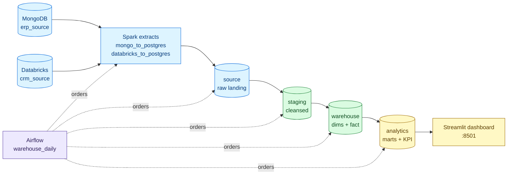
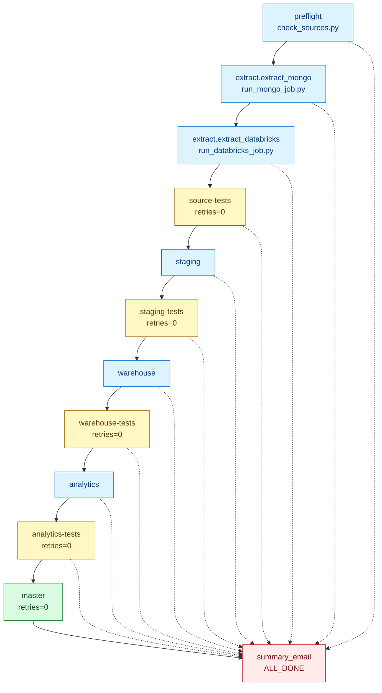
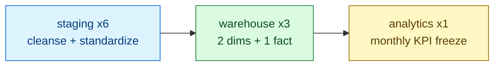
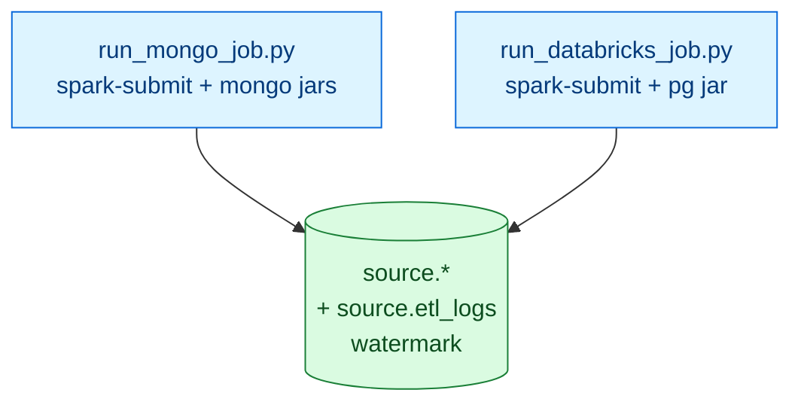
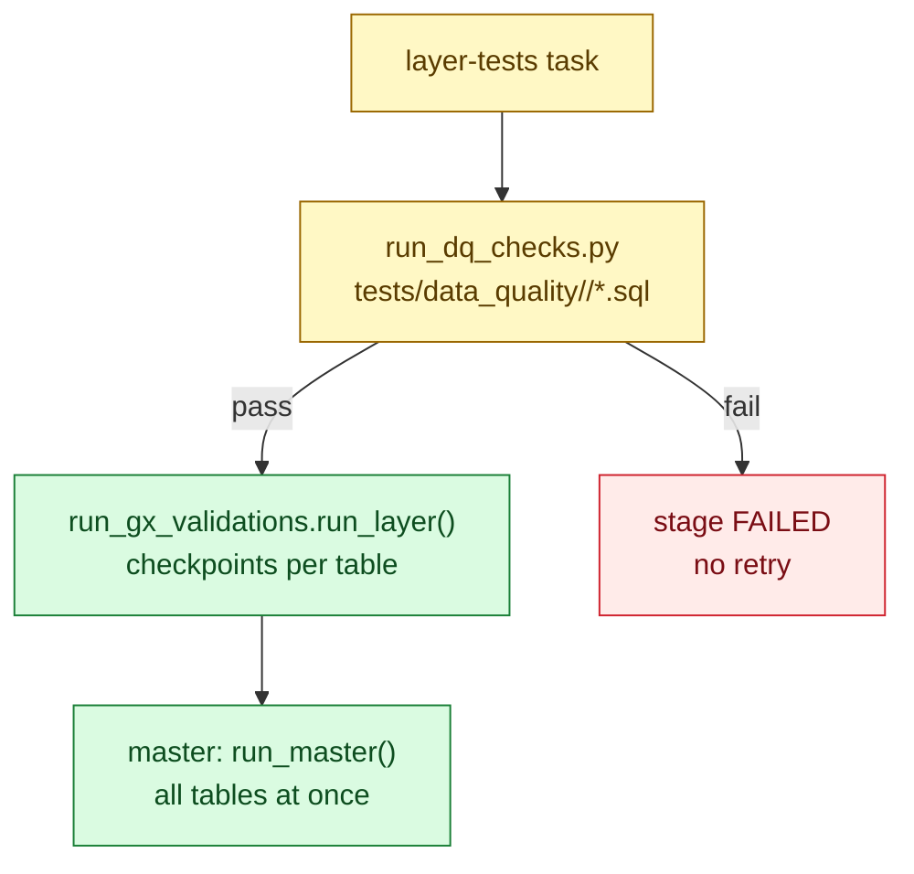
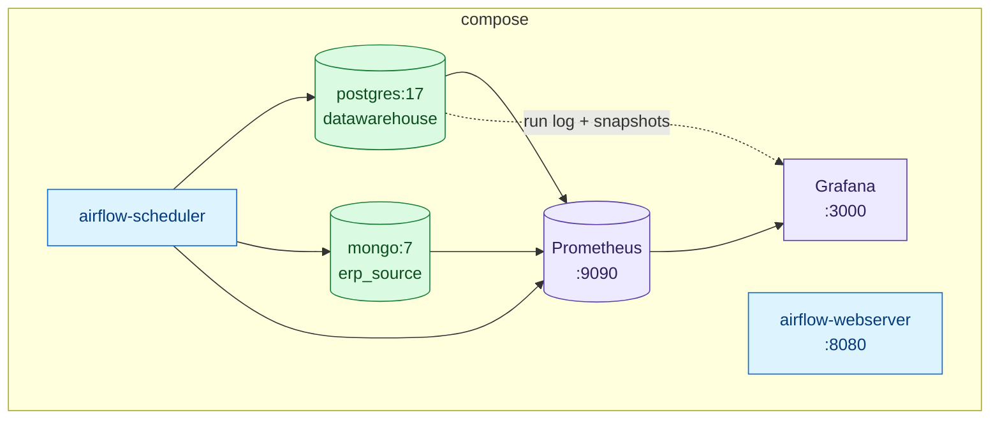

# Architecture

One pipeline, one scheduler, four data layers. Airflow orders the work, `main.py` does the work, Postgres stored procedures move the data.

## 1. System map

| Layer | Schema | Written by | Consumed by |
|---|---|---|---|
| Landing | `source` | Spark jobs | Staging procedures, source-tests |
| Cleansed | `staging` | `staging.*` procedures | Warehouse procedures |
| Business | `warehouse` | `warehouse.*` procedures | Analytics, dashboard |
| Serving | `analytics` | `analytics.*` procedures | Dashboard, KPI readers |

## 2. Airflow dependencies

DAG `warehouse_daily`, schedule `0 11 * * 1-5` (`Asia/Kolkata`), `max_active_runs=1`. Each task runs `uv run main.py --only <stage>`.

Rules: linear chain, extracts run sequentially (two Spark JVMs exceed Docker memory in parallel). `*-tests` and `master` use `retries=0`. `summary_email` has `trigger_rule=ALL_DONE` plus direct edges from every task, then raises to keep failed runs red.

## 3. Stored procedures

Called in listed order via `run_staging_load.call_procedure()`. First failure stops the stage.

| Stage | Procedure | Target |
|---|---|---|
| staging | `staging.load_px_cat_g1v2` | `staging.px_cat_g1v2` |
| staging | `staging.load_cust_info` | `staging.cust_info` |
| staging | `staging.load_prd_info` | `staging.prd_info` |
| staging | `staging.load_cust_az12` | `staging.cust_az12` |
| staging | `staging.load_loc_a101` | `staging.loc_a101` |
| staging | `staging.load_sales_details` | `staging.sales_details` |
| warehouse | `warehouse.load_dim_customers` | `warehouse.dim_customers` |
| warehouse | `warehouse.load_dim_products` | `warehouse.dim_products` |
| warehouse | `warehouse.load_fact_sales` | `warehouse.fact_sales` |
| analytics | `analytics.load_monthly_kpi_snapshot` | `analytics.monthly_kpi_snapshot` |

## 4. Extract path

Each job tracks its watermark and run history in `source.etl_logs`. `_submit.py` resolves `spark-submit`, sets `PYSPARK_PYTHON`, defaults `SPARK_DRIVER_MEMORY=1g`.

## 5. Quality gates

Every layer runs SQL checks first, then Great Expectations. DQ failure skips GX for that layer.

## 6. Infra and observability

`main.py` writes `ops.pipeline_run_log` per stage and `ops.table_snapshot` per layer (`src/utils/tracking.py`). Grafana reads Postgres directly for data alerts and Prometheus for infra. Airflow sends task-failure and run-summary emails.
