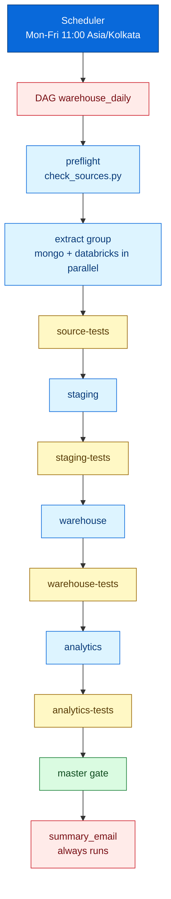
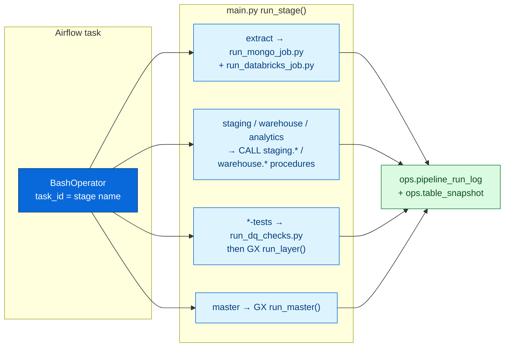
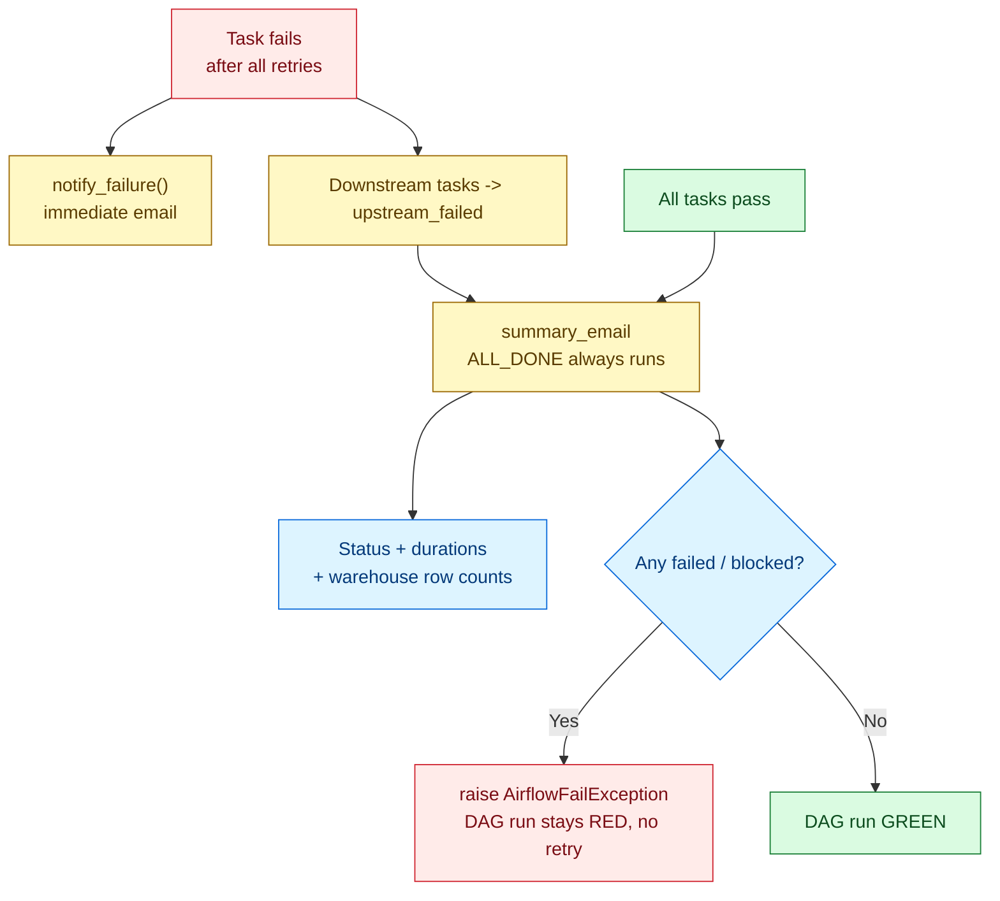

# Airflow — How We Plan and Execute the Pipeline

> One DAG runs the whole warehouse. One file to read: `airflow/dags/warehouse_daily.py`.

## 1. Big picture

Airflow is the **scheduler and executor**. It does not contain business logic —
each task just calls `main.py --only <stage>` or a script, and `main.py`
does the real work (Spark extracts, SQL procedures, DQ + GX checks).



## 2. How we plan a pipeline run

| Planning question | Answer in this repo |
|---|---|
| What is the unit of work? | One stage: `extract`, `source-tests`, `staging`, `staging-tests`, `warehouse`, `warehouse-tests`, `analytics`, `analytics-tests`, `master`. Defined in `STAGES` in `main.py`. |
| What order? | Strictly linear, except `extract_mongo` + `extract_databricks` run in parallel inside a `TaskGroup(group_id="extract")`. |
| When does it run? | `schedule="0 11 * * 1-5"`, `start_date=2025-01-01`, `catchup=False`, `max_active_runs=1`, `dagrun_timeout=6h`. Business timezone from `BUSINESS_TIMEZONE` (default `Asia/Kolkata`). |
| What can fail safely? | Quality gates (`*-tests`, `master`) use `retries=0` — a failed data check will not fix itself by retrying. Load stages use the default `retries=2` with exponential backoff. |
| What must always happen? | `summary_email` has `trigger_rule=ALL_DONE`, plus explicit edges from every upstream task, so it runs even when middle tasks die and downstream is `upstream_failed`. |

## 3. How we execute — task to command map

Each `BashOperator` runs inside the Airflow image (`airflow/Dockerfile.airflow`)
with the repo mounted at `/opt/warehouse`:

```text
cd /opt/warehouse && uv run --project /opt/warehouse main.py --only <stage>
```



| DAG task | Command | Timeout | Retries |
|---|---|---|---|
| `preflight` | `uv run scripts/check_sources.py` | 10 min | 1, 2 min delay |
| `extract.extract_mongo` | `uv run scripts/run_mongo_job.py` | 2 h | 2 (default) |
| `extract.extract_databricks` | `uv run scripts/run_databricks_job.py` | 2 h | 2 (default) |
| `source-tests`, `staging`, `staging-tests`, `warehouse`, `warehouse-tests`, `analytics`, `analytics-tests`, `master` | `uv run main.py --only <same-name>` | 1 h each | gates `0`, loads `2` |
| `summary_email` | `PythonOperator(send_summary)` | 10 min | 1, 2 min delay |

Retry defaults (`DEFAULT_ARGS`):

```text
retries=2, retry_delay=10m, exponential backoff, max_retry_delay=60m
on_failure_callback=notify_failure (except summary_email itself)
```

## 4. Failure and email behavior



* `notify_failure` — short email per failed task: DAG, run id, attempt, duration, error, log link. Skipped silently if `ALERT_EMAILS` is empty.
* `send_summary` — one final email: pass count, wall time, per-task table with state badges, row counts for `dim_customers`, `dim_products`, `fact_sales`, `monthly_kpi_snapshot`, plus failed / blocked / retried notes.
* SMTP comes from `AIRFLOW__SMTP__*` in `.env`; recipients from `ALERT_EMAILS`.

## 5. Configuration you must set

From `.env.example` (never commit the real `.env`):

```text
AIRFLOW__CORE__FERNET_KEY, AIRFLOW__WEBSERVER__SECRET_KEY, AIRFLOW_DB_PASSWORD
AIRFLOW_DB_USER / AIRFLOW_DB_NAME, AIRFLOW_UID=50000
ALERT_EMAILS, WAREHOUSE_CONN_ID, AIRFLOW_CONN_WAREHOUSE_POSTGRES
BUSINESS_TIMEZONE=Asia/Kolkata
```

Docker services (`docker-compose.yml`): `postgres`, `mongo`, `airflow-metadata`
(separate Postgres for Airflow state), `airflow-init` (runs
`docker/entrypoint.sh`: `db migrate` + create admin), `airflow-scheduler`,
`airflow-webserver` (`:8080`), plus the monitoring stack (see `docs/MONITORING.md`).
Airflow emits StatsD metrics to `statsd-exporter:8125` with prefix `airflow`.

## 6. Run it

```bash
docker compose up -d --build          # or: make infra-up
docker compose exec airflow-scheduler airflow dags trigger warehouse_daily
docker compose logs -f airflow-scheduler
```

* UI: `http://localhost:8080` — Grid view shows green / red / grey per task, logs per try.
* Local (no Airflow): `make pipeline`, `make no-extract`, or `python main.py --only staging`.
* One stage == one task id == one `main.py --only` name, so local repro is:
  copy the failing task's `bash_command` and run it.

## 7. Troubleshoot from the UI

| Symptom | Where to look | Fix |
|---|---|---|
| Task red, `summary_email` red too | Task log link in failure email | Fix data/code, clear or re-trigger DAG |
| Task grey `upstream_failed` | Its upstream task (first red one) | Only the root failure matters |
| DAG not scheduled | Scheduler logs, `import errors` alert | Fix Python syntax in `dags/`, check `BUSINESS_TIMEZONE` |
| Email missing | `ALERT_EMAILS`, SMTP vars, spam | `notify_failure` logs a warning and never masks the real error |
| Run stuck > 6 h | `dagrun_timeout` kills it | Check Spark extract logs, Postgres locks |

> Full observability (Prometheus, Grafana, alerts, health script): see `docs/MONITORING.md`.
