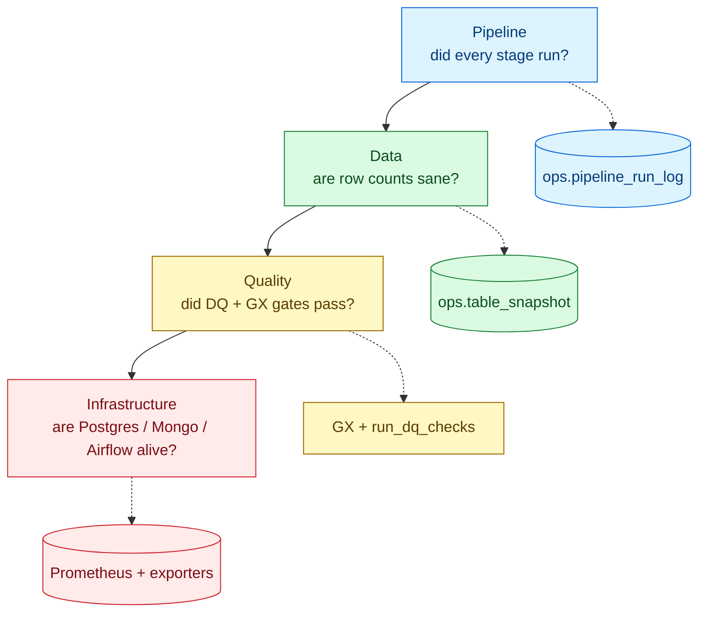
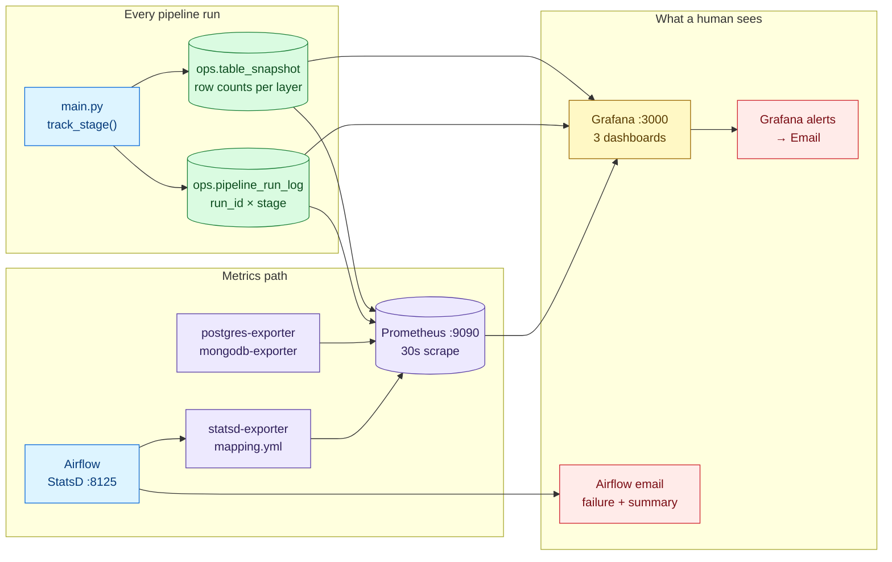
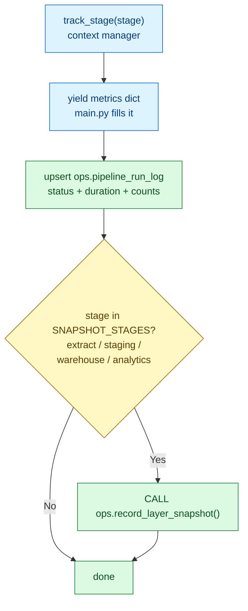
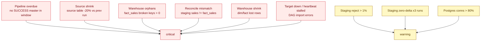
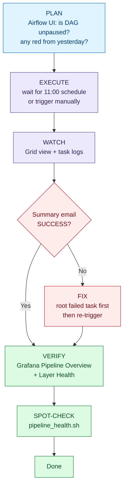

# Monitoring — How We Know the Pipeline Is Healthy

> Airflow tells you *a task failed*. Monitoring tells you *the data is wrong,
> the warehouse is stale, or the database is about to fall over* — usually
> before anyone complains.

## 1. The four layers we watch



| Layer | Source of truth | You look at |
|---|---|---|
| Pipeline runs | `ops.pipeline_run_log` (written by `src/utils/tracking.py`) | Grafana *Pipeline Overview*, summary email |
| Data volume | `ops.table_snapshot` (row count per table per run) | Grafana *Layer Health*, shrink alerts |
| Quality gates | `run_dq_checks.py` + Great Expectations | `*-tests` tasks, *Layer Health* panels |
| Infrastructure | Prometheus + `postgres-exporter`, `mongodb-exporter`, `statsd-exporter` | Grafana *Infrastructure*, infra alerts |

## 2. End-to-end monitoring flow



* Solid arrows = Prometheus scrapes. Dashed arrows = Grafana queries Postgres directly via the `warehouse` datasource (`postgres:5432`, read-only `grafana_ro` user).
* `monitoring/statsd/mapping.yml` converts Airflow StatsD names (`airflow.dagrun.duration.*`, `airflow.operator_failures_*`) into Prometheus metrics (`airflow_dagrun_duration`, `airflow_operator_failures`).
* Retention: Prometheus keeps 30 days (`--storage.tsdb.retention.time=30d`).

## 3. Database tables that power everything

Created by `sql/02_ops_monitoring.sql`, written by `track_stage()` — monitoring
never breaks the pipeline (write failures are logged, not raised).

* `ops.pipeline_run_log(run_id, stage, status, attempt, started_at, duration_s, rows_in, rows_out, rows_rejected, detail)` — one row per stage per run; retries upsert the same row. `detail` JSONB holds per-step breakdown plus `dq_failed` / `gx_failed` counts for test stages.
* `ops.table_snapshot(run_id, layer, table_name, row_count, captured_at)` — filled by `CALL ops.record_layer_snapshot(run_id)` after `extract`, `staging`, `warehouse`, `analytics`.



## 4. Grafana dashboards (provisioned, no clicks needed)

| Dashboard | Answers | Key panels (all SQL on `ops.*` unless noted) |
|---|---|---|
| `pipeline-overview.json` | Did yesterday's run work? | Last master status, hours since last success, stage durations, reject ratio, failed DQ/GX |
| `layer-health.json` | Did data volume change unexpectedly? | Source / staging / warehouse rows over time, extract durations, orphan keys, reconcile staging vs `fact_sales` |
| `infrastructure.json` | Is the platform alive? (Prometheus datasource) | `pg_up`, Postgres connection %, Mongo up, `up==0` targets, `airflow_scheduler_heartbeat`, DAG import errors |

Open: `http://localhost:3000` → *Warehouse* folder. Datasources (`Prometheus`, `Warehouse`) and dashboards are auto-provisioned from `monitoring/grafana/provisioning/`.

## 5. Alerts — what fires and what to do

Data alerts evaluate every 15 min (`warehouse-data` group); infra alerts every
5 min (`warehouse-infra`). All route to the `Email` contact point (`SMTP_USER`).



| Alert (`rules.yaml` uid) | Fires when | First action |
|---|---|---|
| `wh-overdue` (critical) | Hours since last `master=SUCCESS` minus expected window (25 h weekday / 73 h weekend) > 0 | Check Airflow Grid for the failed task; check scheduler heartbeat |
| `wh-source-shrink` (critical) | Any `source` table dropped > 20% vs previous snapshot | Verify upstream Mongo/Databricks, then re-run extract |
| `wh-reject-ratio` (warning) | Latest `staging` run rejected > 1% (`rows_rejected/rows_in`) | Check source null keys, then the extract that fed it |
| `wh-zero-delta` (warning) | Last 3 successful `staging` runs moved 0 rows | Upstream gave no new data — confirm with source owners |
| `wh-orphans` (critical) | `fact_sales` has orphan products/customers > 0 | Fix dimension loads before fact |
| `wh-reconcile` (critical) | `staging.sales_details` count ≠ `warehouse.fact_sales` count | Warehouse load lost/duplicated rows |
| `wh-warehouse-shrink` (critical) | Any warehouse table lost rows | Do not reload blindly — investigate deletes first |
| `wh-target-down`, `wh-heartbeat`, `wh-import-errors` (critical) | `up==0`, scheduler heartbeat stalled 5 min, import errors > 0 | `docker compose ps`, scheduler logs, fix DAG syntax |
| `wh-pg-conns` (warning) | `pg_stat_activity_count / max_connections` > 0.8 | Kill idle sessions, raise `max_connections` |

## 6. Daily routine: plan → execute → monitor



Commands:

```bash
docker compose up -d --build                       # start everything
docker compose exec airflow-scheduler airflow dags trigger warehouse_daily
bash scripts/pipeline_health.sh --max-age-hours 48 # add --gx for DQ+GX gates
docker compose logs -f airflow-scheduler prometheus grafana
```

`pipeline_health.sh` checks: Postgres reachable, no empty tables across
source/staging/warehouse, watermarks fresh (`cust_info`, `sales_details`,
`dim_customers`, `monthly_kpi_snapshot`), no failed `source.etl_logs` in 7 days.

## 7. Troubleshooting cheat sheet

| Symptom | Check in order |
|---|---|
| No summary email | `ALERT_EMAILS`, `AIRFLOW__SMTP__*`, spam → `summary_email` task log |
| Grafana "No data" | `docker compose ps` → Prometheus targets `:9090/targets` → `postgres-exporter` / `statsd-exporter` logs |
| Alert false-positive after backfill | `ops.pipeline_run_log` timestamps — `wh-overdue` uses wall clock, backfills confuse it |
| Row counts flatlined | `ops.table_snapshot` `captured_at` — did `record_snapshot()` run? Check `SNAPSHOT_STAGES` |
| Postgres slow | *Infrastructure* dashboard: connections %, then `pg_stat_activity` for locks |

Files: `airflow/dags/warehouse_daily.py` (schedule + emails) · `main.py` + `src/utils/tracking.py` (run log) · `sql/02_ops_monitoring.sql` (tables) · `monitoring/prometheus/prometheus.yml` + `monitoring/statsd/mapping.yml` (metrics) · `monitoring/grafana/` (dashboards, datasources, alert rules) · `scripts/pipeline_health.sh`, `scripts/check_sources.py` (spot checks).
